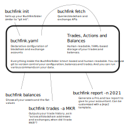

Buchfink - Plaintext Crypto Taxes
=================================


Buchfink is a commandline application that you can use for keeping book over
your crypto trades and generate profit/loss statements and tax reports.

Under the hood, Buchfink uses algorithms and data structures from
[Rotki](https://github.com/rotki/rotki), the open source portfolio tracker. But
instead of a GUI, user accounts and an encrypted database, Buchfink uses the
CLI and plain text files for declarative configuration and trade storage.

Note: Buchfink is early alpha. Do NOT use it for tax or trading purposes.
But feel free to report bugs and missing features.

## Architecture



## Installation

Install Buchfink like this (you may want to create a virtualenv):

    pip install git+https://github.com/coinyon/buchfink.git

## Usage

Create a new directory where you want to store your data and initialize Buchfink:

    buchfink init

Then, edit `buchfink.yaml` to fit your needs. You can add your accounts (see
below) and change accounting settings like the main currency.

### Check balances

You can then check your balances by running:

    buchfink balances

### Tax reports

In order to prepare your tax or profit/loss report, you need to to retrieve your
individual trades. Do this by running:

    buchfink fetch

Then you can generate an ad-hoc tax report like this:

    buchfink report -n my_tax_2019 --from=2019-01-01 --to=2020-01-01

You can also declare reports in your `buchfink.yaml`.

Buchfink also allows you to print out the "tax-free allowances", i.e. the
amounts of each asset that you are able to sell tax-free at this point in time:

    buchfink allowances

Of course, this only applies to a jurisdiction where crypto assets are tax-free
after a certain period.

## Configuration

### Add exchange accounts

Just add the account to your `buchfink.yaml` like this:

```yaml
accounts:
  - name: kraken1
    exchange: kraken
    api_key: ...
    secret: ...
```

You can add multiple accounts for each exchange. Buchfink supports all
exchanges that Rotki supports, namely:

  * binance
  * bitcoinde (Bitcoin.de)
  * bitmex
  * bittrex
  * coinbase
  * coinbasepro
  * gemini
  * iconomi
  * kraken
  * poloniex

If your exchange is not supported yet, see the section "Add manual accounts"
below and add your data manually.

### Add blockchain accounts

To add your Ethereum and Bitcoin blockchain accounts, add them to your
`buchfink.yaml` as well:

```yaml
accounts:
  - name: donation-address
    ethereum: '0xFa2C0AbdaeDc8099887914Ab25AD11B3846655B9'

  - name: random-btc-address
    bitcoin: '1A1zP1eP5QGefi2DMPTfTL5SLmv7DivfNa'

  ...
```

Buchfink is able to fetch the account balances for blockchain accounts and
supports a variety of Ethereum protocols (see Rotki for more information).
On-chain trades are also supported for some protocols (e.g. Uniswap).

### Add manual accounts

Adding manual accounts is easy, just create a new YAML file containing your
trades (and/or balances) and at this to your `buchfink.yaml`.

```yaml
accounts:
  - name: otc
    file: accounts/otc.yaml
```

The file `accounts/otc.yaml` may look like this:

```yaml
trades:
- buy: 1 BTC
  for: 1000 USD
  link: '1'
  timestamp: '2017-01-15T19:49:27'
- sell: 1 BTC
  for: 16000 USD
  link: '2'
  timestamp: '2017-11-15T19:51:26'
```

Note: This is exactly the same serialization format that the `fetch` command
generates for your exchanges trades. So you can easily amend missing trades by
copy and pasting and changing the relevant lines.

The manual account YAML file can also contain assets or liablities that will be
respected by the `buchfink balances` command:

```yaml
assets:
- amount: 0.5
  asset: ETH
- amount: 10
  asset: KNC
liablities:
- amount: 100
  asset: DAI
```

### Settings

Global settings can be configured in `buchfink.yaml` in the `settings` section:

```yaml
settings:

  # The base currency that is used for accounting and reports
  main_currency: USD

  # Seconds after which an asset can be sold tax-free
  taxfree_after_period: 31536000
```

## Donation

If you find this useful and want to contribute to further development, consider an
ETH or ERC-20 donation at [coinyon.eth](https://etherscan.io/address/coinyon.eth).

I also encourage you to try out and support
[Rotki](https://github.com/rotki/rotki). Buchfink would not be possible without it.
